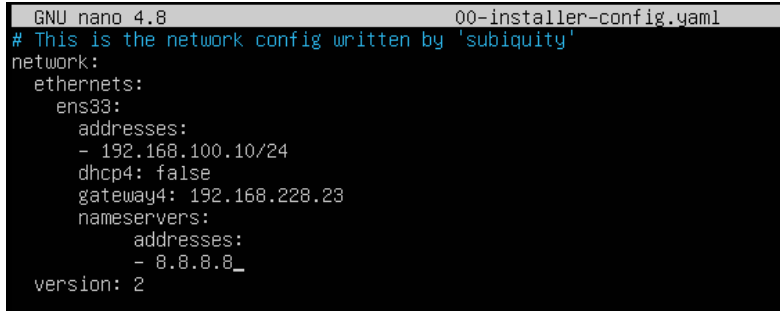
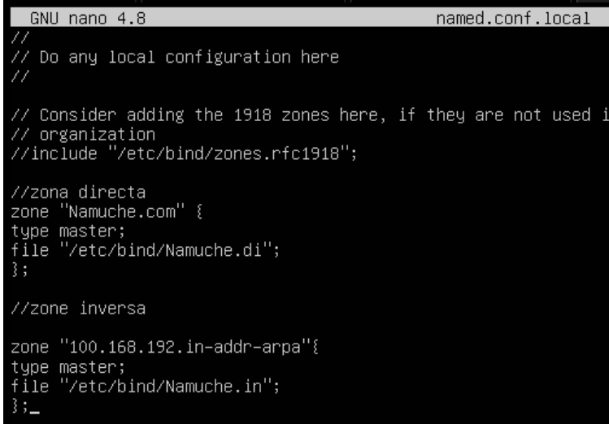
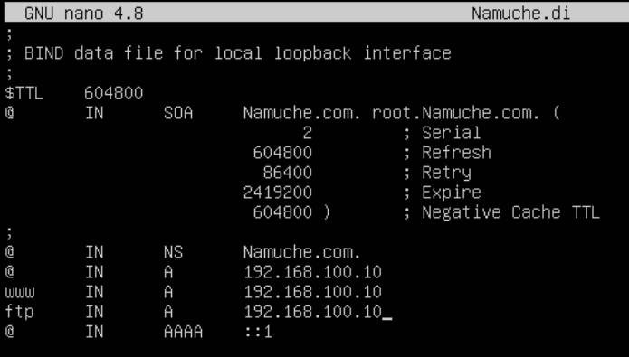
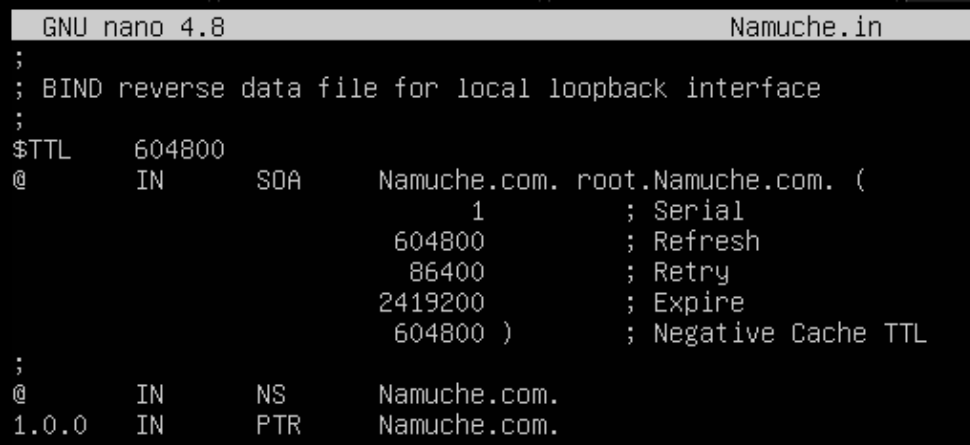

# Semana 7
El protocolo de configuración dinámica de host (en inglés: Dynamic Host Configuration Protocol,
también conocido por sus siglas de DHCP), desarrollado a partir de 1985 como extensión de BOOTP,
es un protocolo de red de tipo cliente/servidor1​ mediante el cual un servidor DHCP asigna dinámicamente
una dirección IP y otros parámetros de configuración de red a cada dispositivo en una red para que
puedan comunicarse con otras redes IP.

## Instalar paquetes `como root`
```ruby
sudo apt install bind9 dnsutils net-tools
```

## Rutear y editar a `/etc/netplan`
```ruby
cd /etc/netplan
```
y editamos el archivo `00-installer-config.yaml`

```ruby
sudo [nano o nvim] 00-installer-config.yaml
```


y aplicamos cambios
```ruby
sudo netplan apply
```
Luego hacemos un ifconfig para ver si se actualizo la IP, en este caso estamos utilizando la IP 192.168.100.10
```ruby
ifconfig
```

## Entramos al directorio bind
```ruby
cd /etc/bind
```

### Configuramos zonas
```ruby
sudo nano named.conf.local
```
y lo configuramos de la siguiente manera


realizamos un checked
```ruby
sudo named-checkconf
```

### Creacion de directorios *.di y *.in
```ruby
# En la carpeta /etc/bind
# * = filename personalizado
cp db.local *.di
cp db.127 *.in
```

## Configuración `*.di` y `*.in`



realizamos el check de zonas
```ruby
named-checkzone *.dominio *.di
named-checkzone *.dominio *.in
```
Colocamos en una red interna el servidor y cliente y realizamos el ping respectivo.

# Semana 8 [Dinamic Host Configuration Protocol (DHCP)]

## Editar el archivo dhcp.conf
```ruby
sudo nvim /etc/dhcp/dhcp.conf

# Change after `ddns-update-style: none`
group netlocal {
  subnet 192.168.100.0 netmask 255.255.255.0 {
    range 192.168.100.120 192.168.100.130
    range 192.168.100.136 192.168.100.200
    # Se excluyen de la 192.168.100.131 - 192.168.100.135
    option domain-name "moran.net";
    option domain-name-servers 192.168.100.10;
    option routers 192.168.100.10;
    option broadcast-address 192.168.100.255;

    host moran {
      hardware ethernet [MAC-ADDRESS]
      # Reserva de IP 192.168.100.140
      fixed-address 192.168.100.140
    }
  }
}
```

## Reiniciamos el servicio bind9
```ruby
systemctl restart bind9
# Y checamos el estado del servicio
systemctl status bind9

# Active: active(running)
```


